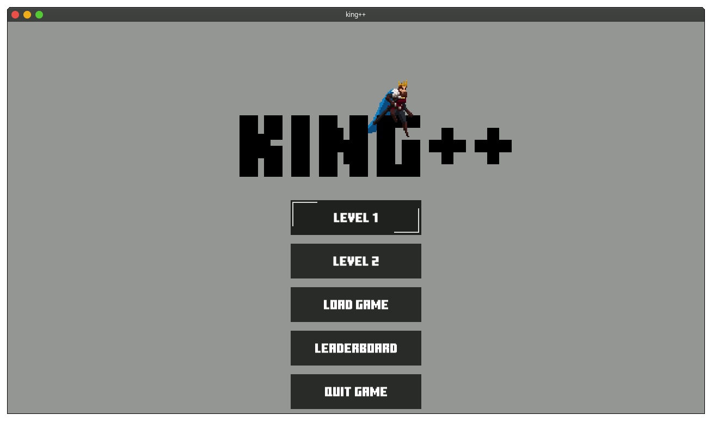

# King++

A C++ Object Oriented game made using the SFML library, for the Técnicas de Programação (Programing Techniques) course at UTFPR.
There is a video showing the game running [here](https://www.youtube.com/watch?v=h4fTbRznCiw).



## Prerequisites

* [SFML](https://www.sfml-dev.org/) - Simple and Fast Multimedia Library.
* C++ Compiler.

## Installing

If you don't want to compile it yourself, you can get a release version from [Releases](https://github.com/MatheusBurda/king/releases/tag/1.0).

These instructions will get you a copy of the project up and running on your local LINUX machine for development and testing purposes.

Clone the repository:
```
git clone https://github.com/MatheusBurda/king.git
```

Compile/ Run:
```
make all
./king
```

## Playing

* Player 1 controls: **W** - Jump, **A** - Walk left, **D** - Walk right, **Spacebar** - Attack. 
* Player 2 controls: **Arrow Up** - Jump, **Arrow Left** - Walk left, **Arrow Right** - Walk right, **Right Control** - Attack. 


## Authors

* **Matheus Burda** - *Start to finish* - [Github](https://github.com/MatheusBurda)
* **Vitor Dalprá** - *Start to finish* - [Github](https://github.com/)


## License

This project is licensed under the MIT License - see the [LICENSE.md](LICENSE.md) file for details